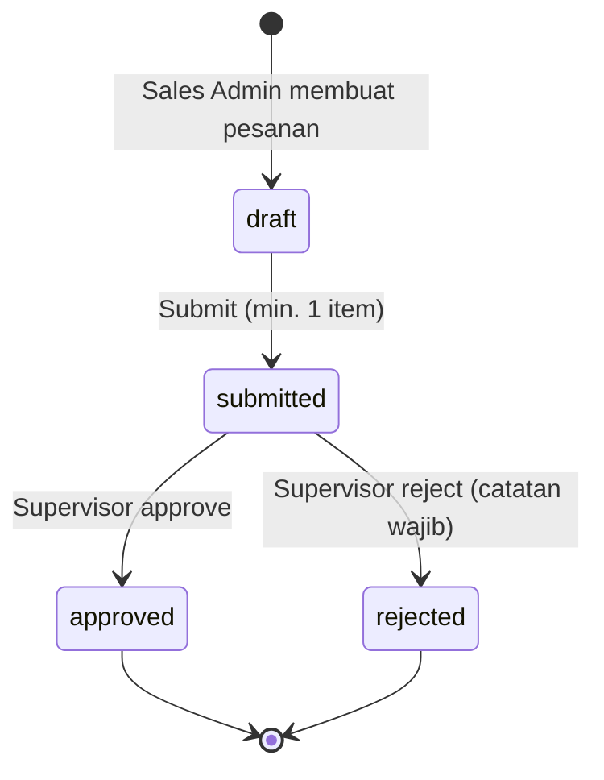
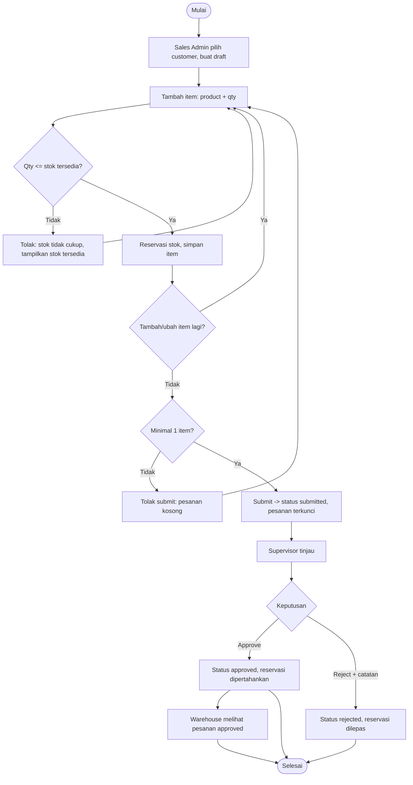

# 01 — Aktor, Alur Proses, dan Status

Turunan dari [PRD](../prd/PRD_Sales_Order_MVP.md). Label **[USULAN]** = usulan analis yang belum diputuskan klien dan harus dikonfirmasi (lihat daftar di bagian 6). Tidak ada usulan yang dianggap final.

## 1. Aktor

| Aktor | Peran di aplikasi | Sumber |
|---|---|---|
| Sales Admin | Membuat dan mengubah draft pesanan, mengecek stok, men-submit. | Transkrip ("Sales"), disebut Sales Admin pada permintaan analisis |
| Supervisor | Menyetujui atau menolak pesanan `submitted` dengan catatan; melihat semua pesanan dan audit. | Transkrip |
| Warehouse | Melihat pesanan yang sudah `approved` agar tahu pesanan sebelum dokumen dikirim. **[USULAN]** hanya baca (OQ-1). | Transkrip (masalah: "baru mengetahui pesanan setelah dokumen dikirim") |

Di luar aktor aplikasi: System Analyst dan Application Developer (peran proyek).

## 2. Status Pesanan

| Status | Arti | Dapat diubah? |
|---|---|---|
| `draft` | Pesanan sedang disusun oleh Sales Admin; stok sudah direservasi per item **[ASUMSI-1]**. | Ya, oleh Sales Admin pembuat |
| `submitted` | Diajukan, menunggu keputusan Supervisor. | Tidak (terkunci) **[ASUMSI-3]** |
| `approved` | Disetujui Supervisor; reservasi dipertahankan **[ASUMSI-4]**. | Tidak (final) |
| `rejected` | Ditolak Supervisor dengan catatan; reservasi dilepas **[ASUMSI-4]**. | Tidak (final) **[USULAN]**, OQ-3 |

## 3. Transisi Status

| ID | Dari | Ke | Aktor | Syarat | Efek stok | Dicatat di audit |
|---|---|---|---|---|---|---|
| TR-1 | (baru) | draft | Sales Admin | Customer aktif | — | `created` |
| TR-2 | draft | submitted | Sales Admin pemilik | ≥ 1 item; semua qty masih valid | Reservasi tetap | `submitted` |
| TR-3 | submitted | approved | Supervisor | Catatan opsional **[USULAN]** OQ-4 | Reservasi tetap | `approved` |
| TR-4 | submitted | rejected | Supervisor | Catatan wajib **[USULAN]** OQ-4 | Reservasi dilepas | `rejected` |

Semua kombinasi lain ditolak (ERR-07). Tidak ada tarik-kembali `submitted` dan tidak ada edit ulang `rejected` **[USULAN]** (OQ-3): pesanan baru harus dibuat.

## 4. Alur Proses Usulan

Setiap langkah yang mengubah data menulis satu baris audit (siapa, kapan, aksi, nilai lama/baru).

## 5. Di Luar Alur (tidak dirancang)

Harga/diskon/pajak (OQ-6), tindak lanjut pengiriman (OQ-11), kedaluwarsa draft (OQ-2), deteksi pesanan ganda selain nomor unik (OQ-9), pembayaran, integrasi eksternal, notifikasi WhatsApp.

## 6. Usulan yang Perlu Dikonfirmasi Klien

| ID | Usulan | Terkait |
|---|---|---|
| U-1 | Warehouse hanya baca, dan hanya melihat pesanan `approved`. | OQ-1 |
| U-2 | `rejected` final; harus buat pesanan baru. | OQ-3 |
| U-3 | Catatan wajib saat reject, opsional saat approve; maksimal 1000 karakter. | OQ-4 |
| U-4 | Reservasi dibuat saat item disimpan pada `draft`. | OQ-2 / ASUMSI-1 |
| U-5 | Sales Admin hanya melihat dan mengubah pesanan miliknya. | OQ-1 |
| U-6 | Nomor pesanan dibuat sistem, format `SO-yyyymmdd-nnnn`. | OQ-6 |
| U-7 | Satu product muncul sekali per pesanan. | OQ-9 |
