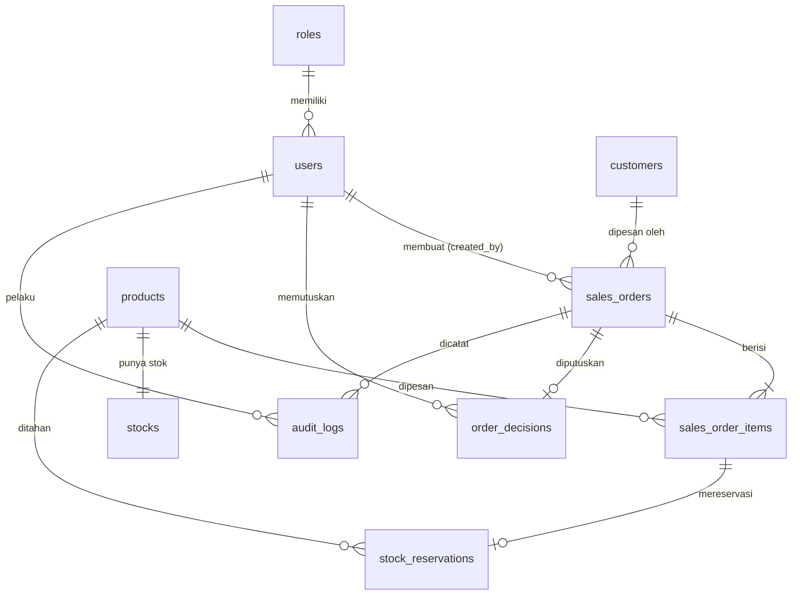

# 04 — Desain Data: ERD dan Data Dictionary

Sumber DBML: [../schema.dbml](../schema.dbml) (diperbarui untuk rencana ini). Target Microsoft SQL Server. Label **[USULAN]** merujuk ke 01-process.md bagian 6.

## 1. ERD

## 2. Data Dictionary

Kolom: tipe SQL Server; N = boleh NULL. Kebutuhan merujuk ke PRD (FR) dan 02-rules.md (BR).

### roles
| Kolom | Tipe | N | Keterangan | Kebutuhan |
|---|---|---|---|---|
| id | int PK | | | FR-9 |
| code | varchar(30) unik | | `sales_admin`, `supervisor`, `warehouse` | FR-9 |
| name | nvarchar(100) | | Nama tampil | |

### users
| Kolom | Tipe | N | Keterangan | Kebutuhan |
|---|---|---|---|---|
| id | bigint PK | | | |
| role_id | int FK → roles | | Satu role per pengguna | FR-9 |
| name | nvarchar(150) | | | |
| email | varchar(190) unik | | Login | |
| password | varchar(255) | | Hash (skema autentikasi OQ-10) | |
| is_active | bit | | Default 1 | |
| created_at / updated_at | datetime2 | updated N | UTC | |

### customers
| Kolom | Tipe | N | Keterangan | Kebutuhan |
|---|---|---|---|---|
| id | bigint PK | | | FR-1 |
| code | varchar(30) unik | | Dari data awal | FR-1 |
| name | nvarchar(200) | | | FR-1 |
| is_active | bit | | BR-12 | |
| created_at / updated_at | datetime2 | updated N | | |

### products
| Kolom | Tipe | N | Keterangan | Kebutuhan |
|---|---|---|---|---|
| id | bigint PK | | | FR-1 |
| sku | varchar(40) unik | | | FR-1 |
| name | nvarchar(200) | | | FR-1 |
| uom | varchar(20) | | Satuan | FR-1 |
| is_active | bit | | BR-12 | |
| created_at / updated_at | datetime2 | updated N | | |

### stocks
| Kolom | Tipe | N | Keterangan | Kebutuhan |
|---|---|---|---|---|
| id | bigint PK | | | |
| product_id | bigint FK unik → products | | Satu baris per product | FR-3 |
| qty_on_hand | decimal(18,3) | | CHECK ≥ 0 | BR-02 |
| qty_reserved | decimal(18,3) | | CHECK ≥ 0 dan ≤ qty_on_hand | BR-02, BR-03 |
| row_version | rowversion | | Kontrol konkurensi | BR-03 |
| updated_at | datetime2 | N | | |

Stok tersedia = `qty_on_hand − qty_reserved` (dihitung, tidak disimpan).

### sales_orders
| Kolom | Tipe | N | Keterangan | Kebutuhan |
|---|---|---|---|---|
| id | bigint PK | | | FR-2 |
| order_no | varchar(30) unik | | Dibuat sistem **[USULAN]** U-6 | BR-14 |
| customer_id | bigint FK → customers | | | FR-2 |
| created_by | bigint FK → users | | Sales Admin pemilik | BR-05, BR-13 |
| status | varchar: draft/submitted/approved/rejected | | Default `draft` | FR-5 |
| note | nvarchar(500) | N | | |
| submitted_at | datetime2 | N | Terisi saat submit | FR-5 |
| decided_at | datetime2 | N | Terisi saat approve/reject | FR-6 |
| created_at / updated_at | datetime2 | updated N | | |

Indeks: `status`, `customer_id`, `created_by`, `created_at` (daftar dan filter, FR-7).

### sales_order_items
| Kolom | Tipe | N | Keterangan | Kebutuhan |
|---|---|---|---|---|
| id | bigint PK | | | FR-2 |
| sales_order_id | bigint FK → sales_orders | | | FR-2 |
| product_id | bigint FK → products | | | FR-2 |
| qty | decimal(18,3) | | CHECK > 0 | BR-01 |

Unik: (`sales_order_id`, `product_id`) **[USULAN]** U-7 (BR-04).

### stock_reservations
| Kolom | Tipe | N | Keterangan | Kebutuhan |
|---|---|---|---|---|
| id | bigint PK | | | FR-4 |
| sales_order_item_id | bigint FK unik → sales_order_items | | Satu reservasi per item; qty diperbarui saat item berubah | FR-4 |
| product_id | bigint FK → products | | | FR-4 |
| qty | decimal(18,3) | | CHECK > 0; sama dengan qty item | BR-03 |
| status | varchar: active/released | | `released` saat reject/hapus (BR-09) | BR-09 |
| reserved_at | datetime2 | | | |
| released_at | datetime2 | N | | |

### order_decisions
| Kolom | Tipe | N | Keterangan | Kebutuhan |
|---|---|---|---|---|
| id | bigint PK | | | FR-6 |
| sales_order_id | bigint FK unik → sales_orders | | Satu keputusan per pesanan karena keputusan final **[USULAN]** U-2 | BR-10 |
| decided_by | bigint FK → users | | Supervisor | BR-07 |
| decision | varchar: approve/reject | | | FR-6 |
| note | nvarchar(1000) | N | Wajib bila reject (BR-08) | BR-08 |
| decided_at | datetime2 | | | |

### audit_logs
| Kolom | Tipe | N | Keterangan | Kebutuhan |
|---|---|---|---|---|
| id | bigint PK | | | FR-8 |
| sales_order_id | bigint FK → sales_orders | N | | FR-8 |
| user_id | bigint FK → users | | Pelaku | FR-8 |
| action | varchar(40) | | `created`, `item_added`, `item_changed`, `item_removed`, `submitted`, `approved`, `rejected`, `draft_deleted` | BR-11 |
| entity_type | varchar(40) | | `sales_order`, `sales_order_item`, `stock_reservation` | |
| entity_id | bigint | N | | |
| old_values / new_values | nvarchar(max) | N | JSON | FR-8 |
| note | nvarchar(1000) | N | | |
| created_at | datetime2 | | | FR-8 |

Append-only (BR-11): hanya INSERT; UPDATE/DELETE dicegah di level DB (hak akses atau trigger).

## 3. Catatan Perubahan terhadap schema.dbml Sebelumnya

- Kode role dibuat `sales_admin`, `supervisor`, `warehouse`.
- `order_decisions.sales_order_id` dibuat unik.
- `stock_reservations.sales_order_item_id` dibuat unik (satu reservasi per item).
- Kolom lain tetap; harga/diskon/pajak tetap tidak dimodelkan (OQ-6).
