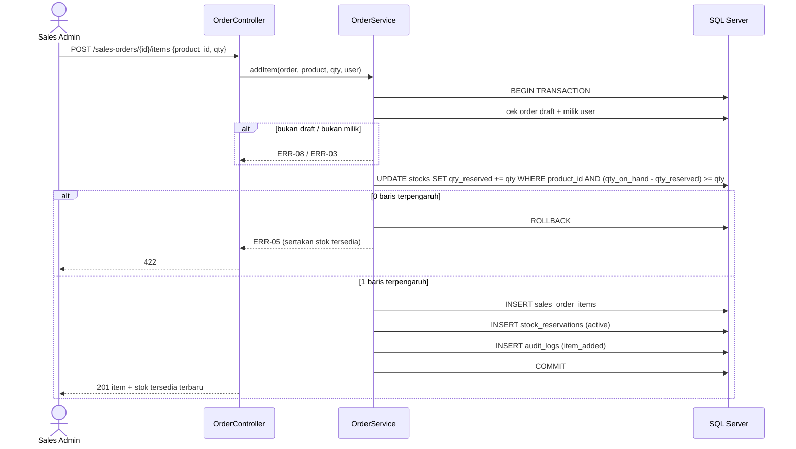

# 05 — Sequence Diagram, Rancangan API, dan Daftar Layar

Ini rancangan, belum implementasi. Gaya autentikasi mengikuti OQ-10 dan pilihan frontend belum diputuskan; rancangan di bawah netral terhadap keduanya. Label **[USULAN]** merujuk ke 01-process.md bagian 6. Kode ERR merujuk ke 02-rules.md.

## 1. Sequence Diagram

### 1.1 Menambah item dengan reservasi stok (US-02)



Pengecekan dan penambahan reservasi berada dalam satu UPDATE bersyarat sehingga dua permintaan bersamaan tidak bisa sama-sama lolos (BR-03, SC-02-7).

### 1.2 Submit pesanan (US-04)

```mermaid
sequenceDiagram
    actor SA as Sales Admin
    participant API as OrderController
    participant SVC as OrderService
    participant DB as SQL Server
    SA->>API: POST /sales-orders/{id}/submit
    API->>SVC: submit(order, user)
    SVC->>DB: BEGIN; SELECT order WITH (UPDLOCK)
    alt status bukan draft
        SVC-->>API: ERR-07
    else tanpa item
        SVC-->>API: ERR-09
    else valid
        SVC->>DB: UPDATE status=submitted, submitted_at
        SVC->>DB: INSERT audit_logs (submitted)
        SVC->>DB: COMMIT
        API-->>SA: 200 status submitted
    end
```

### 1.3 Approve atau reject (US-05, US-06)

```mermaid
sequenceDiagram
    actor SV as Supervisor
    participant API as OrderController
    participant SVC as OrderService
    participant DB as SQL Server
    SV->>API: POST /sales-orders/{id}/approve atau /reject {note}
    API->>SVC: decide(order, decision, note, user)
    SVC->>DB: BEGIN; SELECT order WITH (UPDLOCK)
    alt status bukan submitted
        SVC-->>API: ERR-07
    else reject tanpa catatan
        SVC-->>API: ERR-10
    else approve
        SVC->>DB: INSERT order_decisions (approve)
        SVC->>DB: UPDATE status=approved, decided_at
        SVC->>DB: INSERT audit_logs (approved)
    else reject
        SVC->>DB: INSERT order_decisions (reject, note)
        SVC->>DB: UPDATE stock_reservations SET status=released
        SVC->>DB: UPDATE stocks SET qty_reserved -= qty (per item)
        SVC->>DB: UPDATE status=rejected, decided_at
        SVC->>DB: INSERT audit_logs (rejected)
    end
    SVC->>DB: COMMIT
    API-->>SV: 200
```

Kunci `UPDLOCK` dan unique `order_decisions.sales_order_id` memastikan hanya satu keputusan lolos pada permintaan bersamaan (SC-05-5).

## 2. Rancangan API

Prefiks `/api`, JSON. Semua endpoint membutuhkan login (ERR-01) kecuali login. Role: SA = Sales Admin, SV = Supervisor, WH = Warehouse. Aturan visibilitas BR-13 diterapkan pada setiap pembacaan pesanan.

| ID | Metode & path | Role | Fungsi | Sukses | Error utama | Story |
|---|---|---|---|---|---|---|
| E-01 | POST `/login`, POST `/logout` | semua | Masuk/keluar (mekanisme: OQ-10) | 200 | 401/422 | — |
| E-02 | GET `/customers` | SA | Daftar customer aktif untuk form | 200 | ERR-02 | US-01 |
| E-03 | GET `/products` | SA, SV | Product aktif + stok tersedia | 200 | ERR-02 | US-02 |
| E-04 | POST `/sales-orders` `{customer_id, note?}` | SA | Buat draft | 201 | ERR-02, ERR-11 | US-01 |
| E-05 | GET `/sales-orders?status=&q=&page=` | SA, SV, WH | Daftar, cari, filter | 200 | 422 filter tidak valid | US-07 |
| E-06 | GET `/sales-orders/{id}` | SA, SV, WH | Detail + item | 200 | ERR-03 | US-07 |
| E-07 | DELETE `/sales-orders/{id}` | SA | Hapus draft, lepas reservasi | 204 | ERR-03, ERR-08 | US-03 |
| E-08 | POST `/sales-orders/{id}/items` `{product_id, qty}` | SA | Tambah item + reservasi | 201 | ERR-03/04/05/06/08/11/12 | US-02 |
| E-09 | PATCH `/sales-orders/{id}/items/{item}` `{qty}` | SA | Ubah qty | 200 | ERR-03/04/05/08/12 | US-03 |
| E-10 | DELETE `/sales-orders/{id}/items/{item}` | SA | Hapus item, lepas reservasi | 204 | ERR-03, ERR-08 | US-03 |
| E-11 | POST `/sales-orders/{id}/submit` | SA | Submit | 200 | ERR-03/07/09 | US-04 |
| E-12 | POST `/sales-orders/{id}/approve` `{note?}` | SV | Approve | 200 | ERR-02/07/10 | US-05 |
| E-13 | POST `/sales-orders/{id}/reject` `{note}` | SV | Reject | 200 | ERR-02/07/10 | US-06 |
| E-14 | GET `/sales-orders/{id}/audit` | SA, SV, WH | Audit trail kronologis | 200 | ERR-03 | US-08 |

Tidak ada endpoint PUT/PATCH/DELETE untuk audit log; permintaan semacam itu dijawab 405 (ERR-13) (SC-08-3).

Bentuk respons error: lihat 02-rules.md bagian 3. Pagination daftar: ukuran halaman default dan batas ditetapkan saat implementasi.

## 3. Daftar Layar

| ID | Layar | Role | Isi utama | Endpoint | Story |
|---|---|---|---|---|---|
| S-01 | Login | semua | Form login | E-01 | — |
| S-02 | Daftar Pesanan | SA, SV, WH | Tabel, pencarian, filter status, pagination, keadaan kosong | E-05 | US-07 |
| S-03 | Form Pesanan (draft) | SA | Pilih customer, tabel item, tambah/ubah/hapus item, tampil stok tersedia, tombol Submit, tombol Hapus draft | E-02, E-03, E-04, E-07..E-11 | US-01..04 |
| S-04 | Detail Pesanan | SA, SV, WH | Header, item, status, catatan keputusan, tab Audit | E-06, E-14 | US-07, US-08 |
| S-05 | Antrian Approval | SV | Daftar `submitted`, tombol Approve/Reject dengan kolom catatan | E-05, E-12, E-13 | US-05, US-06 |
| S-06 | Audit Trail | SA, SV, WH | Linimasa aksi, pelaku, waktu, nilai lama/baru | E-14 | US-08 |

Tombol aksi disembunyikan sesuai role dan status, tetapi kontrol akses tetap ditegakkan di server (BR-05, BR-07).
