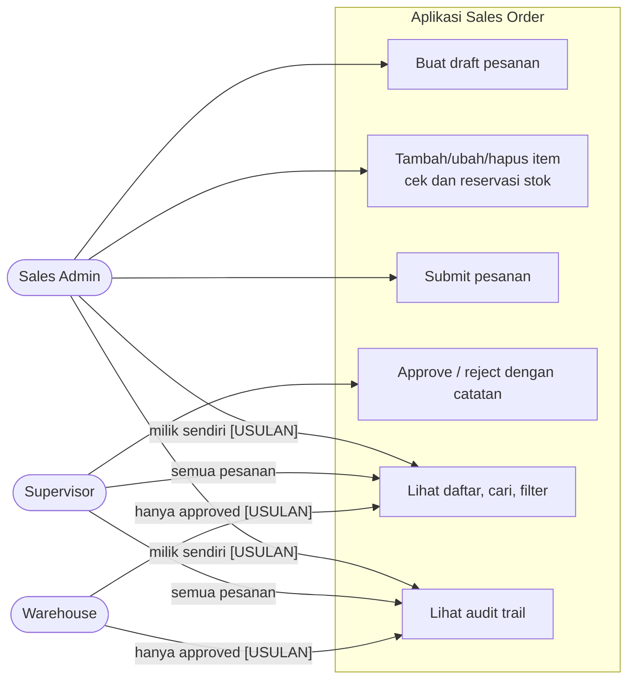
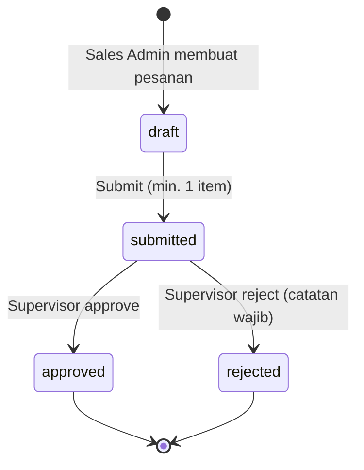
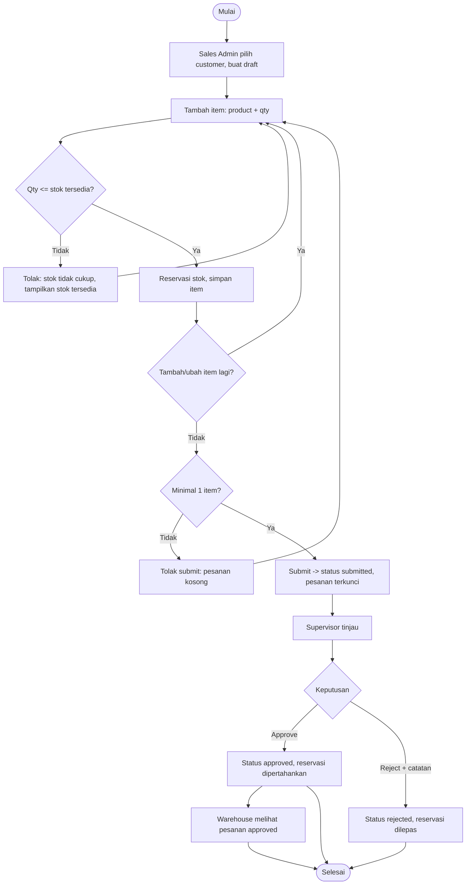
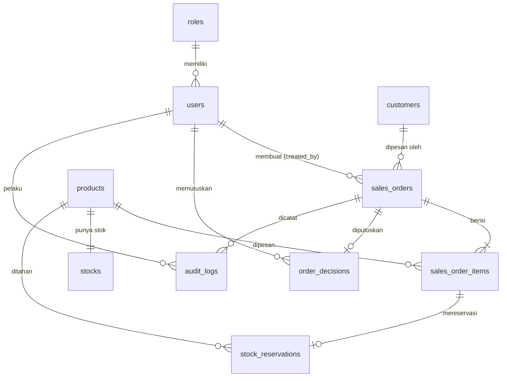
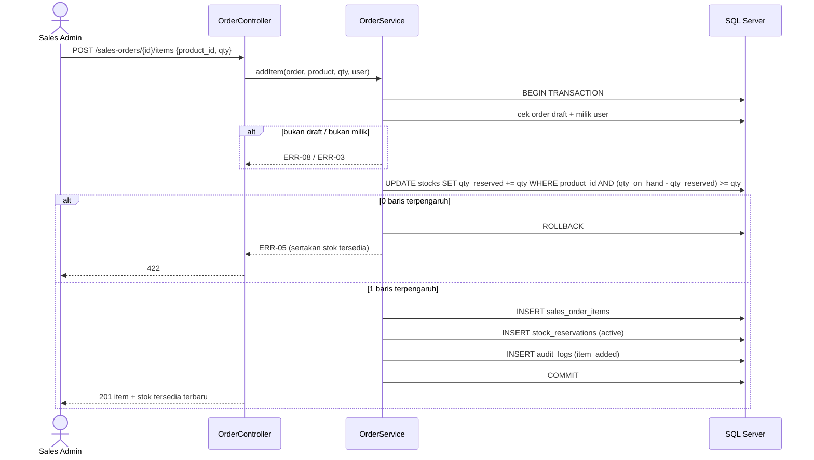
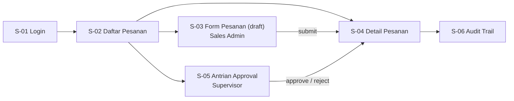

# 07 — Kumpulan Diagram (Mermaid)

Semua diagram desain dalam satu berkas, sebagai teks Mermaid. Dapat ditempel ke mermaid.live atau dirender langsung oleh GitHub, VS Code, dan Obsidian. Penjelasan lengkap tiap diagram ada di dokumen sumbernya. Bila ada selisih, dokumen sumber (01, 04, 05) yang berlaku; perbarui berkas ini bersamaan.

Label **[USULAN]** = belum diputuskan klien (01-process.md bagian 6).

## 1. Aktor dan Hak Akses (ikhtisar)

Sumber: 02-rules.md bagian 2 (matriks hak akses).



## 2. Diagram Status Pesanan

Sumber: 01-process.md bagian 3.



## 3. Alur Proses Usulan

Sumber: 01-process.md bagian 4.



## 4. ERD

Sumber: 04-data.md bagian 1 dan [../schema.dbml](../schema.dbml).



## 5. Sequence: Menambah Item dengan Reservasi Stok (US-02)

Sumber: 05-interface.md bagian 1.1.



## 6. Sequence: Submit Pesanan (US-04)

Sumber: 05-interface.md bagian 1.2.

```mermaid
sequenceDiagram
    actor SA as Sales Admin
    participant API as OrderController
    participant SVC as OrderService
    participant DB as SQL Server
    SA->>API: POST /sales-orders/{id}/submit
    API->>SVC: submit(order, user)
    SVC->>DB: BEGIN; SELECT order WITH (UPDLOCK)
    alt status bukan draft
        SVC-->>API: ERR-07
    else tanpa item
        SVC-->>API: ERR-09
    else valid
        SVC->>DB: UPDATE status=submitted, submitted_at
        SVC->>DB: INSERT audit_logs (submitted)
        SVC->>DB: COMMIT
        API-->>SA: 200 status submitted
    end
```

## 7. Sequence: Approve atau Reject (US-05, US-06)

Sumber: 05-interface.md bagian 1.3.

```mermaid
sequenceDiagram
    actor SV as Supervisor
    participant API as OrderController
    participant SVC as OrderService
    participant DB as SQL Server
    SV->>API: POST /sales-orders/{id}/approve atau /reject {note}
    API->>SVC: decide(order, decision, note, user)
    SVC->>DB: BEGIN; SELECT order WITH (UPDLOCK)
    alt status bukan submitted
        SVC-->>API: ERR-07
    else reject tanpa catatan
        SVC-->>API: ERR-10
    else approve
        SVC->>DB: INSERT order_decisions (approve)
        SVC->>DB: UPDATE status=approved, decided_at
        SVC->>DB: INSERT audit_logs (approved)
    else reject
        SVC->>DB: INSERT order_decisions (reject, note)
        SVC->>DB: UPDATE stock_reservations SET status=released
        SVC->>DB: UPDATE stocks SET qty_reserved -= qty (per item)
        SVC->>DB: UPDATE status=rejected, decided_at
        SVC->>DB: INSERT audit_logs (rejected)
    end
    SVC->>DB: COMMIT
    API-->>SV: 200
```

## 8. Peta Layar dan Navigasi

Sumber: 05-interface.md bagian 3.


