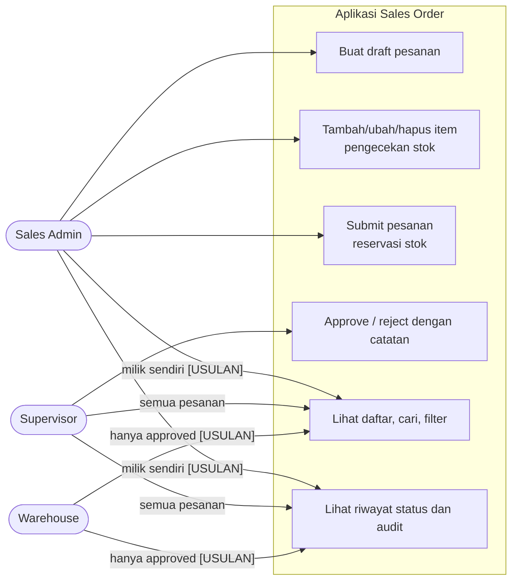
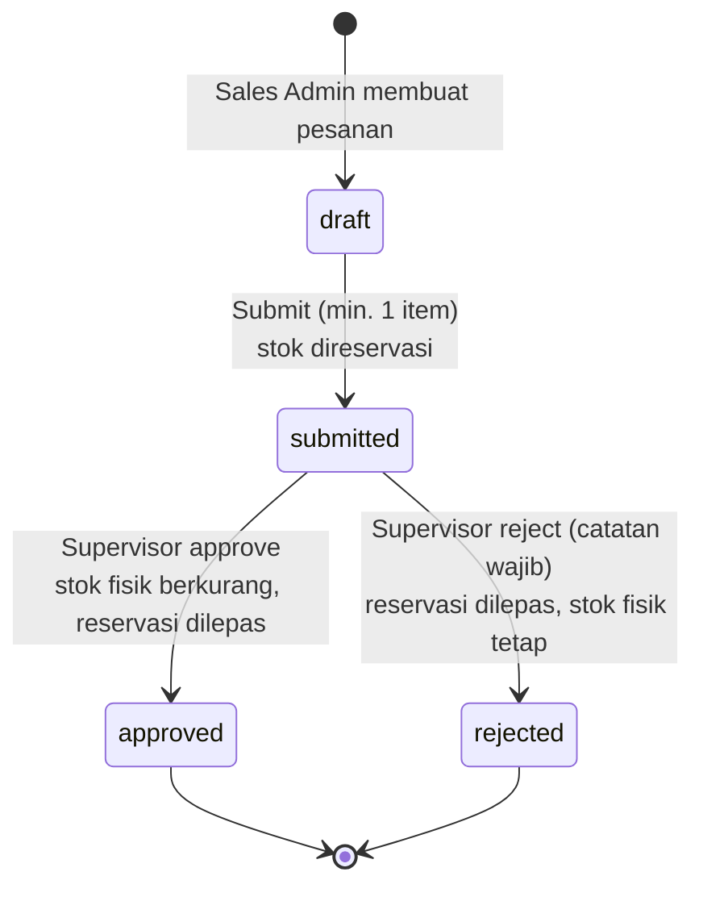
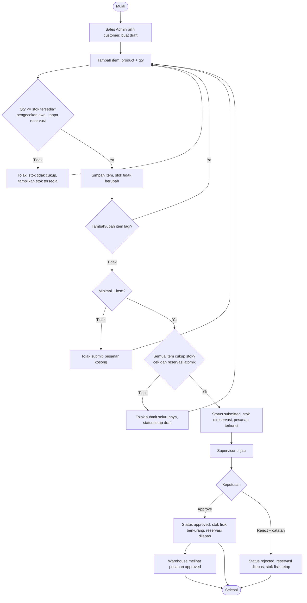
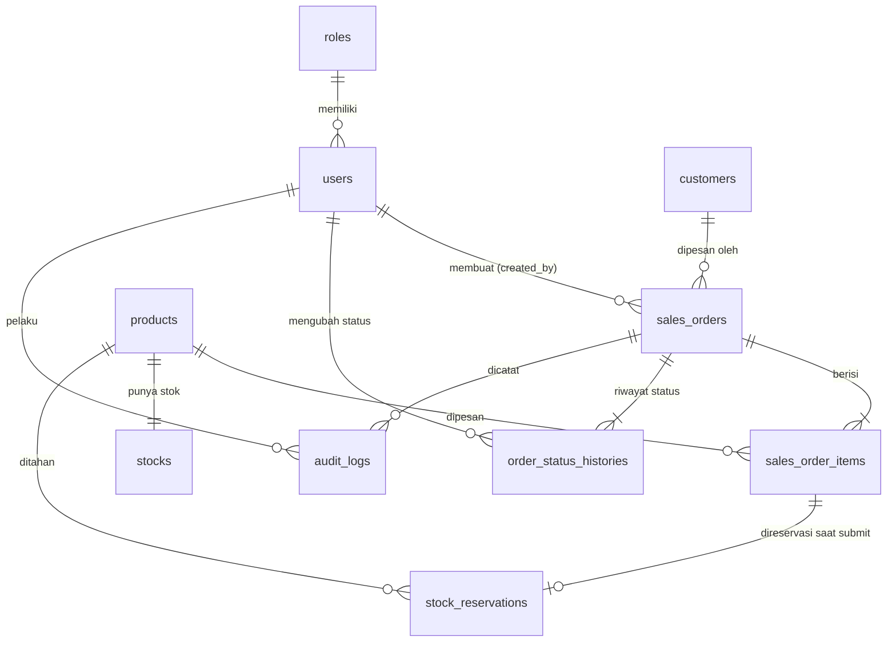
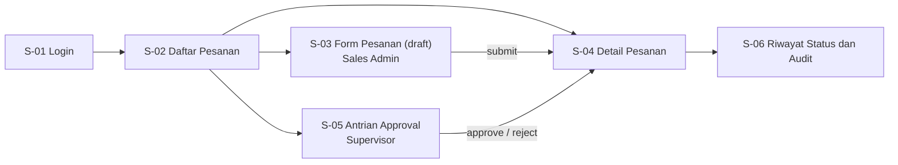

# 07 — Kumpulan Diagram (Mermaid)

Semua diagram desain dalam satu berkas, sebagai teks Mermaid. Dapat ditempel ke mermaid.live atau dirender langsung oleh GitHub, VS Code, dan Obsidian. Berkas ini adalah satu-satunya sumber diagram; dokumen 01, 04, 05 merujuk ke sini. Direvisi mengikuti Aturan Bisnis Minimum (ABM).

Label **[ABM-n]** = keputusan klien; **[USULAN]** = belum diputuskan klien (01-process.md bagian 6).

## 1. Aktor dan Hak Akses (ikhtisar)

Sumber: 02-rules.md bagian 3 (matriks hak akses).



## 2. Diagram Status Pesanan dan Efek Stok

Sumber: 01-process.md bagian 3. Efek stok mengikuti ABM-4.



## 3. Alur Proses Usulan

Sumber: 01-process.md bagian 4.



Setiap perubahan status menulis satu baris riwayat status [ABM-6]; perubahan item dan penghapusan draft menulis audit log.

## 4. ERD

Sumber: [../schema.dbml](../schema.dbml) dan 04-data.md.



## 5. Sequence: Menambah Item dengan Pengecekan Stok (US-02)

Sumber: 05-interface.md. Pengecekan ini tidak mereservasi [ABM-4].

```mermaid
sequenceDiagram
    actor SA as Sales Admin
    participant API as OrderController
    participant SVC as OrderService
    participant DB as SQL Server
    SA->>API: POST /sales-orders/{id}/items {product_id, qty}
    API->>SVC: addItem(order, product, qty, user)
    SVC->>DB: cek order draft + milik user
    alt bukan draft / bukan milik
        SVC-->>API: ERR-08 / ERR-03
    else
        SVC->>DB: baca stok tersedia = qty_on_hand - qty_reserved
        alt qty > tersedia
            SVC-->>API: ERR-05 (sertakan stok tersedia)
            API-->>SA: 422
        else qty <= tersedia
            SVC->>DB: BEGIN; INSERT sales_order_items
            SVC->>DB: INSERT audit_logs (item_added); COMMIT
            API-->>SA: 201 item (stok tidak berubah)
        end
    end
```

## 6. Sequence: Submit dan Reservasi Stok (US-04)

Sumber: 05-interface.md. Reservasi atomik untuk semua item [ABM-4].

```mermaid
sequenceDiagram
    actor SA as Sales Admin
    participant API as OrderController
    participant SVC as OrderService
    participant DB as SQL Server
    SA->>API: POST /sales-orders/{id}/submit
    API->>SVC: submit(order, user)
    SVC->>DB: BEGIN; SELECT order WITH (UPDLOCK)
    alt status bukan draft
        SVC-->>API: ERR-07
    else tanpa item
        SVC-->>API: ERR-09
    else valid
        loop setiap item
            SVC->>DB: UPDATE stocks SET qty_reserved += qty WHERE product_id AND (qty_on_hand - qty_reserved) >= qty
        end
        alt ada item dengan 0 baris terpengaruh
            SVC->>DB: ROLLBACK (tanpa reservasi parsial)
            SVC-->>API: ERR-05 (daftar semua item yang kurang)
            API-->>SA: 422, status tetap draft
        else semua item berhasil
            SVC->>DB: INSERT stock_reservations (active) per item
            SVC->>DB: UPDATE status=submitted, submitted_at
            SVC->>DB: INSERT order_status_histories (draft -> submitted, user, waktu)
            SVC->>DB: COMMIT
            API-->>SA: 200 status submitted
        end
    end
```

## 7. Sequence: Approve atau Reject (US-05, US-06)

Sumber: 05-interface.md. Approve mengurangi stok fisik; reject tidak [ABM-4].

```mermaid
sequenceDiagram
    actor SV as Supervisor
    participant API as OrderController
    participant SVC as OrderService
    participant DB as SQL Server
    SV->>API: POST /sales-orders/{id}/approve atau /reject {note}
    API->>SVC: decide(order, decision, note, user)
    SVC->>DB: BEGIN; SELECT order WITH (UPDLOCK)
    alt status bukan submitted
        SVC-->>API: ERR-07
    else reject tanpa catatan
        SVC-->>API: ERR-10
    else approve
        SVC->>DB: UPDATE stocks SET qty_on_hand -= qty, qty_reserved -= qty (per item)
        SVC->>DB: UPDATE stock_reservations SET status=released
        SVC->>DB: UPDATE status=approved, decided_at
        SVC->>DB: INSERT order_status_histories (submitted -> approved, user, waktu, note)
        SVC->>DB: COMMIT
        API-->>SV: 200 approved
    else reject
        SVC->>DB: UPDATE stocks SET qty_reserved -= qty (per item; qty_on_hand tetap)
        SVC->>DB: UPDATE stock_reservations SET status=released
        SVC->>DB: UPDATE status=rejected, decided_at
        SVC->>DB: INSERT order_status_histories (submitted -> rejected, user, waktu, note)
        SVC->>DB: COMMIT
        API-->>SV: 200 rejected
    end
```

## 8. Peta Layar dan Navigasi

Sumber: 05-interface.md bagian 3.


