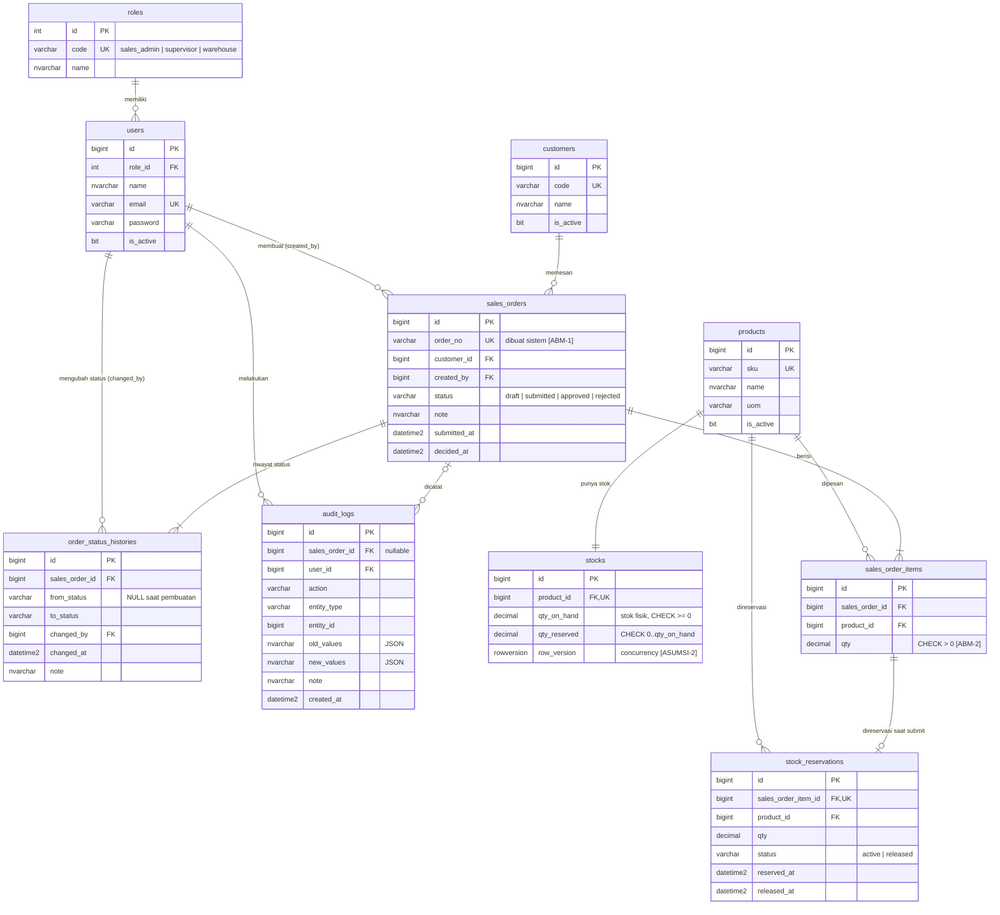

# ERD — MVP Sales Order

Turunan dari [PRD_Sales_Order_MVP.md](../prd/PRD_Sales_Order_MVP.md); detail kolom, constraint, dan index ada di [schema.dbml](../schema.dbml). Data dictionary: [design/04-data.md](../design/04-data.md).
Target database: Microsoft SQL Server (Laravel). Direvisi mengikuti Aturan Bisnis Minimum (ABM, PRD bagian 5.1).

## Ringkasan Relasi

| Relasi | Kardinalitas | Kebutuhan |
|---|---|---|
| roles → users | 1 : N | FR-9 |
| customers → sales_orders | 1 : N (satu pesanan satu customer) | FR-2, ASUMSI-5 |
| users → sales_orders | 1 : N (Sales Admin pembuat) | FR-2 |
| sales_orders → sales_order_items | 1 : N (min. 1 item saat submit) | FR-2, ABM-2 |
| products → stocks | 1 : 1 (satu gudang) | FR-3, ASUMSI-6 |
| sales_order_items → stock_reservations | 1 : 0..1 (dibuat saat submit) | FR-4, ABM-4 |
| sales_orders → order_status_histories | 1 : N (setiap perubahan status) | FR-5, FR-6, ABM-6 |
| sales_orders → audit_logs | 1 : N (append-only) | FR-8 |

## Aturan Kunci

- **Stok tersedia** = `qty_on_hand - qty_reserved` [ABM-3], tidak pernah negatif (CHECK + update atomik).
- **Transisi status**: `draft → submitted → approved | rejected`; selain itu ditolak.
- **Submit** mereservasi stok semua item (`qty_reserved` naik, reservasi `active`); draft tidak menahan stok [ABM-4].
- **Approve**: `qty_on_hand` dan `qty_reserved` berkurang, reservasi `released`. **Reject**: hanya `qty_reserved` berkurang, `qty_on_hand` tetap, reservasi `released` [ABM-4].
- **order_status_histories**: satu baris per perubahan status (pengguna, waktu, status awal, status akhir, catatan) [ABM-6].
- **audit_logs** dan **order_status_histories** hanya INSERT.

## Tidak Dimodelkan (menunggu jawaban klien)

Harga/diskon/pajak (OQ-6), permission rinci per role (OQ-1), deteksi pesanan ganda (OQ-9), pengiriman warehouse (OQ-11).

Catatan implementasi Laravel: tabel `users` bawaan Laravel diperluas dengan `role_id` dan `is_active`.
